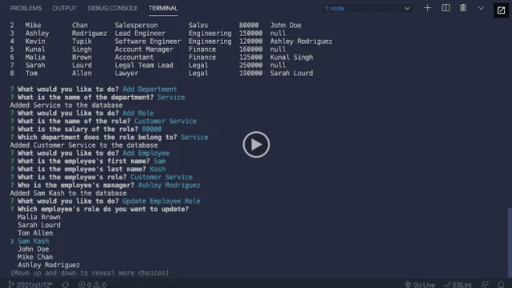

# Employee-Manager-Database

# User Story
I want make this app to help a business owner or managers to manage and view all employee information,roles and show all departments in there company and its give them ability to add and delet employee,roles and departments so it will be very helpfull to orgnaize the business.

# Instalation and use
follow this to install 
1- npm install
2- login to mysql with this code mysql -u root -p and then inter your password.
3- run schema file then run seeds file.
4- exit from mysql.
5- run node index.js.
6- its ready to use now.


# Description
this the linke to app to follow 
- Video link:
- Deployed URL:
- Github URL:https://github.com/oliversh99/Employee-Manager-Database

## Acceptance Criteria

```md
GIVEN a command-line application that accepts user input
WHEN I start the application
THEN I am presented with the following options: view all departments, view all roles, view all employees, add a department, add a role, add an employee, and update an employee role
WHEN I choose to view all departments
THEN I am presented with a formatted table showing department names and department ids
WHEN I choose to view all roles
THEN I am presented with the job title, role id, the department that role belongs to, and the salary for that role
WHEN I choose to view all employees
THEN I am presented with a formatted table showing employee data, including employee ids, first names, last names, job titles, departments, salaries, and managers that the employees report to
WHEN I choose to add a department
THEN I am prompted to enter the name of the department and that department is added to the database
WHEN I choose to add a role
THEN I am prompted to enter the name, salary, and department for the role and that role is added to the database
WHEN I choose to add an employee
THEN I am prompted to enter the employee’s first name, last name, role, and manager, and that employee is added to the database
WHEN I choose to update an employee role
THEN I am prompted to select an employee to update and their new role and this information is updated in the database 
```

## Mock-Up

The following video shows an example of the application being used from the command line:

[](https://2u-20.wistia.com/medias/2lnle7xnpk)

# License
This project is convered under the None License.

# Question
For questions about this project, please reach out by email at oliv.code999@gmail.com
